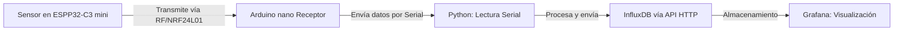
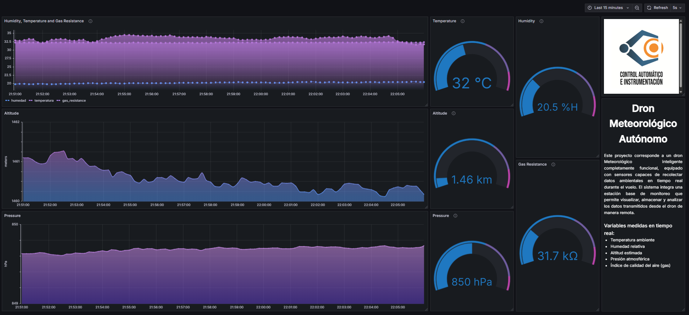

Este proyecto mide variables como temperatura, humedad, presión atmosférica, resistencia de gas y altitud usando el sensor BME688.
Los datos son enviados mediante comunicación entre dos microcontroladores Arduino, luego procesados con un script en Python y almacenados en InfluxDB. 
Finalmente, son visualizados en Grafana.

InfluxDB UI: http://localhost:8086
-  Usuario: daniel
-  Contraseña: danielpassword

Grafana: http://localhost:3000
-  Usuario: admin
-  Contraseña: admin

Flujo de los datos

Diagrama en grafana
